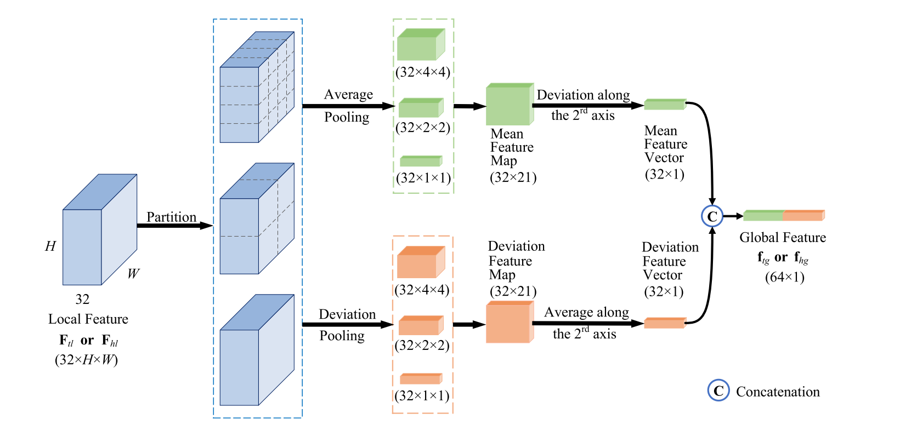

# MeanStdPooling
 the spatial pooling layer based on the mean and standard deviation

 Follow by the paper [《Super-resolution image visual quality assessment based on structure–texture features》](https://doi.org/10.1016/j.image.2023.117025)

 

I am a beginner. If there are any mistakes, please feel free to point them out.
